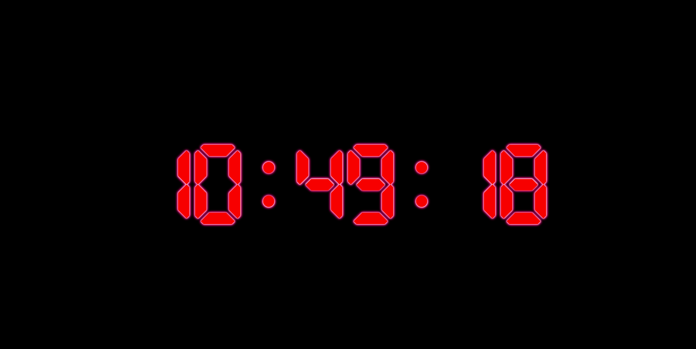

# WEB Clock for DS114

Used and converted to VanillaJS the code of [ifvisible.js](https://github.com/serkanyersen/ifvisible.js).

    With "precise" clock updates.

<div align="center">
    
</div>

This simple clock face uses [special LCD font](https://dl.dafont.com/dl/?f=lcd_at_t_phone_time_date) from [DAFONT](https://dl.dafont.com/) website.
This is the default page on my home based NAS webserver.

## Contents
- index.html the HTML page source.
- style.css holding CSS style definitions plus imported font declarations.
- jquery.min.js compressed jquery package for manipulating page contents and styles.
- app-min.js compressed application script which handles clock face updates.

### Directory structure

```bash
├── css
│   ├── fonts
│   │   ├── Digital-7.woff
│   │   ├── Digital-7.woff2
│   │   ├── Digital-7Italic.woff
│   │   ├── Digital-7Italic.woff2
│   │   ├── Digital-7Mono.woff
│   │   ├── Digital-7Mono.woff2
│   │   ├── Digital-7MonoItalic.woff
│   │   ├── Digital-7MonoItalic.woff2
│   │   ├── digital.css
│   │   ├── lcdat&t.css
│   │   ├── LCDATTPhoneTimeDate.woff
│   │   ├── LCDATTPhoneTimeDate.woff2
│   │   ├── SummerDreamSansDemo.woff
│   │   └── SummerDreamSansDemo.woff2
│   └── style.css
├── js
│   ├── app-min.js
│   ├── app.js
│   ├── jquery.min.js
│   └── jquery.min.map
└── index.html

```
